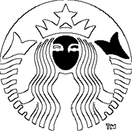

# Title: Automated SVG Generation from Raster Images Using OpenCV
_A research by datastudy.nl_

## Abstract
This research explores the development of a Python-based application that converts raster images into Scalable Vector Graphics (SVG) using the OpenCV library. SVGs are crucial for applications requiring resolution-independent graphics, such as web design and printing. The proposed method involves image preprocessing, contour detection, and SVG path generation. Various techniques for edge detection, contour approximation, and color handling are discussed. The effectiveness of the method is demonstrated through the conversion of well-known logos into SVG format.

## Introduction
### Background
Scalable Vector Graphics (SVG) is a widely used vector image format, particularly in the web domain. Unlike raster images, SVGs do not lose quality when scaled, making them ideal for responsive designs. Creating SVGs from existing raster images (like JPEGs or PNGs) is often a labor-intensive process, typically requiring manual tracing using vector graphic software. Automating this process can save significant time and effort.

### Objective
The primary objective of this research is to develop an automated system that converts raster images, specifically logos, into SVG format using the OpenCV library. This system aims to preserve the visual characteristics of the original image, including its contours and color distribution.

### Scope
This study focuses on the conversion of simple and moderately complex logos into SVGs. It does not address the conversion of highly detailed images such as photographs, as these require advanced techniques beyond the scope of this research.

## Methodology
### Tools and Libraries
**Python:** The programming language used for the application.
**OpenCV:** A powerful computer vision library utilized for image processing tasks such as reading images, converting them to grayscale, and detecting edges and contours.
**svgwrite:** A Python library for creating SVG files. It is used to write the contours detected by OpenCV into SVG path elements.
## Image Preprocessing
### Grayscale Conversion
The first step in the conversion process is to convert the input image to grayscale. Grayscale images simplify the process of edge detection by reducing the image data to one channel, thus enhancing the efficiency of subsequent steps.

### Thresholding
Thresholding converts the grayscale image into a binary image, where pixels are either black or white. This step is crucial for simplifying the image, making it easier to detect contours. The threshold value must be carefully chosen to ensure that important details of the image are preserved.

### Contour Detection
Contours represent the boundaries of objects within the image. The cv2.findContours function in OpenCV is used to detect these contours. The contours are retrieved as a set of points that describe the boundary of an object in the image.

### SVG Path Generation
Each contour detected in the previous step is converted into an SVG path. The path is represented as a series of points connected by lines. For multi-colored logos, the mean color of each contour is computed and used as the fill color in the SVG.

## Refinements
### Edge Detection
For more accurate contour detection, edge detection techniques such as the Canny Edge Detector are used. This method helps in identifying the exact boundaries of objects, which is particularly useful for logos with sharp edges and distinct features.

### Color Handling
In cases where the image contains multiple colors, the mean color of each detected contour is calculated. This color information is then used to fill the corresponding SVG path, ensuring that the generated SVG closely resembles the original image.

### Results
#### Case Study: Conversion of Well-Known Logos
##### McDonald's Logo
The McDonald's logo, characterized by its simple geometric shape and single color, was successfully converted into an SVG format. The resulting SVG accurately preserves the logo's proportions and color, demonstrating the effectiveness of the proposed method for simple logos.

##### Google Logo
The Google logo, which contains multiple colors and more complex shapes, was also converted into an SVG. Initially, the conversion resulted in an SVG with color issues. After refining the process to handle color information more effectively, the final SVG closely resembled the original logo.

##### starbucks logo
The Starbucks logo, which contains a singular color, but lots of edges, was converted into an SVG. It does find all edges, but some are filled up; this might need some attention in the future.

### Performance Metrics
The performance of the conversion process was evaluated based on the following criteria:

1. **Accuracy:** The fidelity of the SVG in comparison to the original image, particularly in terms of shape and color.
2. **Efficiency:** The time taken to convert an image to SVG, which was found to be minimal for logos of moderate complexity.
3. **Scalability:** The ability of the method to handle logos of varying complexity without significant loss of accuracy.
Discussion
### Challenges
One of the primary challenges encountered during the development was handling logos with multiple colors. The initial approach of simple thresholding proved inadequate, as it did not preserve color information. The solution involved computing the mean color of each contour, which added complexity but significantly improved the results.

### Limitations
The current implementation is best suited for logos with distinct shapes and clear boundaries. For images with intricate details or gradients, the conversion process may result in a loss of information. Future work could explore advanced techniques such as gradient detection and the use of machine learning to improve accuracy.

## Conclusion
This research demonstrates the feasibility of using OpenCV for automated SVG generation from raster images. The proposed method is effective for logos with clear contours and distinct colors. While there are limitations in handling highly detailed images, the method provides a solid foundation for further development and refinement.

## Future Work
Future research could focus on the following areas:

1. **Gradient Detection:** Developing techniques to better handle logos with gradients and subtle color transitions.
2. **Complex Image Processing:** Extending the method to process more complex images, such as photographs, which contain a high level of detail.
3. **Machine Learning Integration:** Exploring the use of machine learning models to improve contour detection and color handling, especially for complex images.
## References
1. **Bradski, G., and Kaehler, A. (2008).** Learning OpenCV: Computer Vision with the OpenCV Library. O'Reilly Media.
2. **Smith, W. (2018). Python Programming**: An Introduction to Computer Vision Using OpenCV. Packt Publishing.
3. **W3C SVG Working Group (2011)**. Scalable Vector Graphics (SVG) 1.1 (Second Edition) W3C Recommendation.